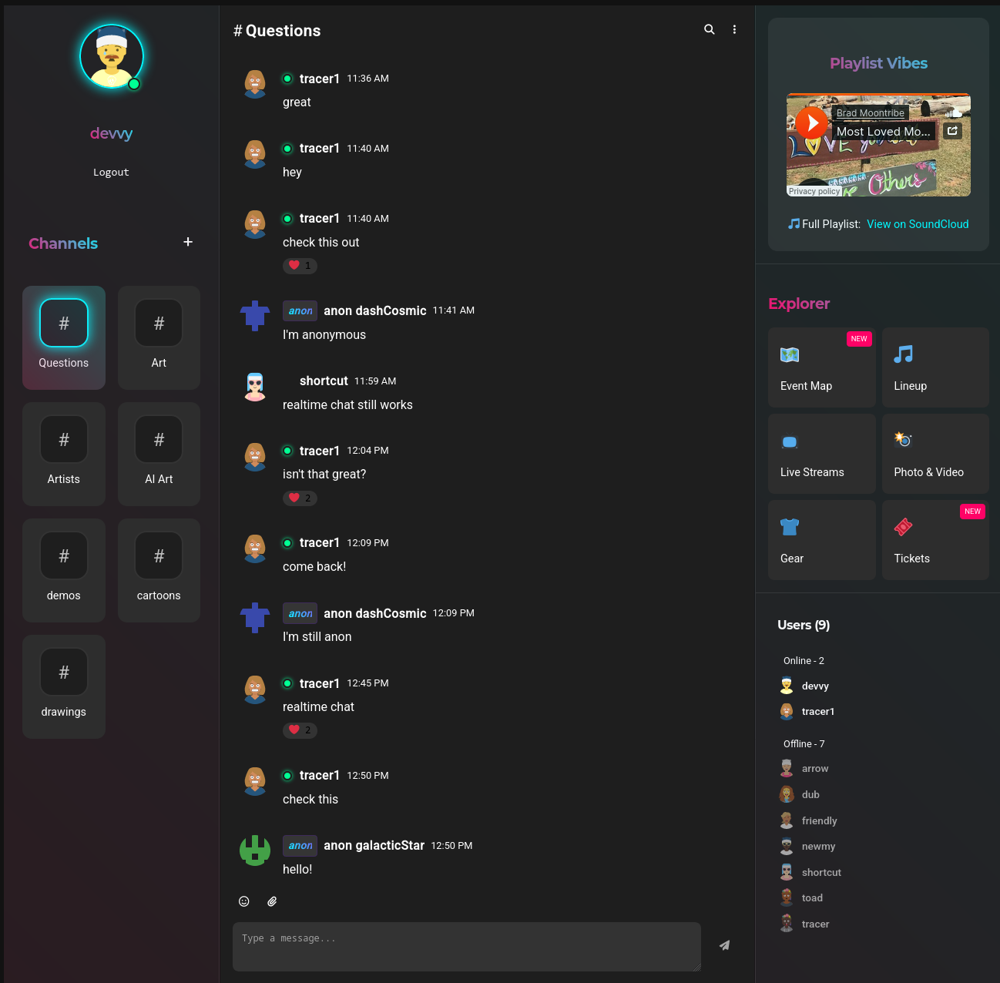

# TribeVibe

**TribeVibe** is a fun communication and information tool for live music events and festivals that connects attendees, organizers, and artists.

## Tech Stack
- **Frontend**: Angular
- **Backend**: NestJS
- **Database**: PostgreSQL

## Current Features
- Basic authentication with supabase
- Anonymous users allowed, with usernames created automatically (with anon indicators)
- Realtime chat
- Create and join channels
- Respond to messages in threads
- Emoji Reactions to messages
- User presence statuses, which the user can set
- 'more messages below' indicator for new messages when scrolled up

## Future Features
- custom avatars
- upload images and videos
- user profiles
- user list
- message search
- admin panel
- Create multiple events, each with their own channels and user access
- User roles (admin, moderator, user)
- typing indicators
- link previews
